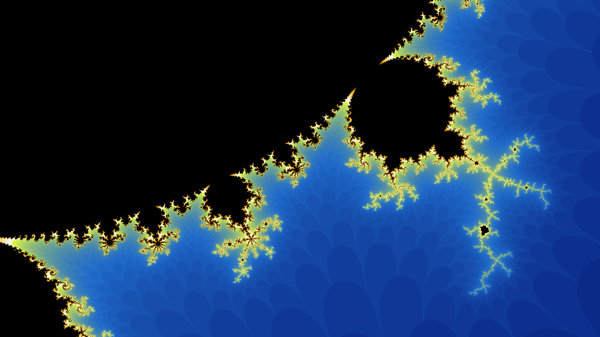
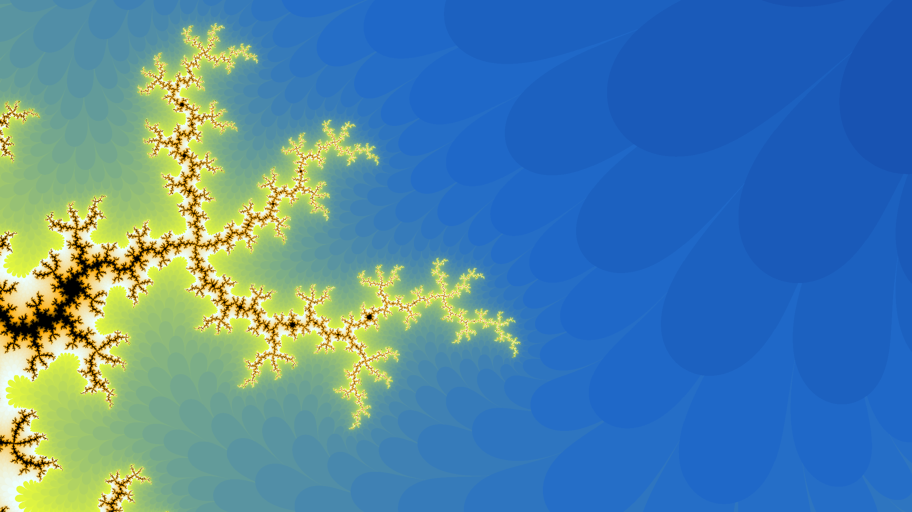
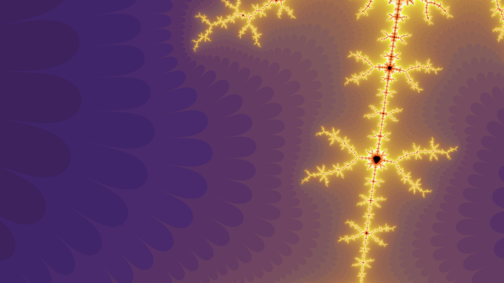

Implementation of the Mandelbrot set drawing with coloring. There are several differnt coloring methods available, such as the linear interpolation of different colors, sudo-random coloring as well as black and white.

### How to Build the executable

Change the preprocessor constants at the top of mandelbrot.c as desired:

``WINDOW_WIDTH`` Specifies the width of the windows in pixels.
``WINDOW_HEIGHT`` Specifies the height of the windows in pixels.
``FULLSCREEN`` Set to 0/1 to disable/enable fullscreen
``MAX_ITER`` Determines the coloring accuracy.
``BOUNDED_THRESHOLD`` *Read comment in mandelbrot.c*
``COLORING`` 1/2/3 *Read comment in mandelbrot.c*

Use ``python compile.py build90`` to build the executable.

### Controls:

``W - Move Camera UP``
``A - Move Camera LEFT``
``S - Move Camera DOWN``
``D - Move Camera RIGHT``
``Q - Increase Zoom``
``E - Decrease Zoom``

### Preview Images

### Libraries Used:
- SDL2 (2.0.9)
